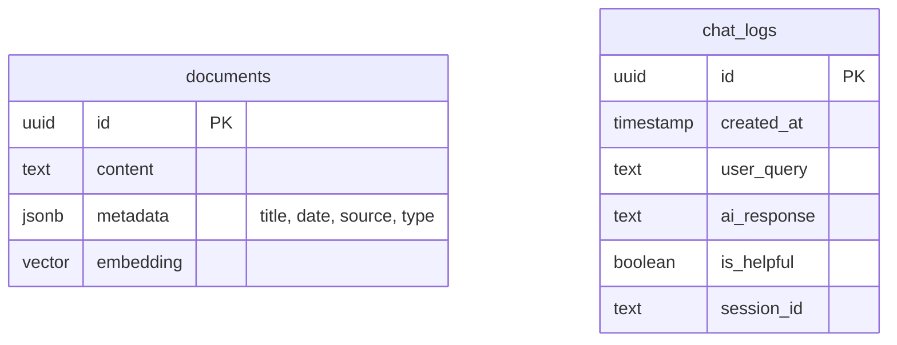

# データベース設計書

## 1. 目的

本ドキュメントは、「Inquiry Chatbot」アプリケーションで使用するデータベース（Supabase）の構造、ER図、およびテーブル定義を明確にすることを目的とします。

## 2. ER図 (Mermaid)

## 3. テーブル定義

各テーブルの詳細なカラム定義、データ型、制約、および説明を記述します。

### 3.1 documents テーブル

RAG（Retrieval-Augmented Generation）で使用するドキュメントデータを格納します。`pgvector` 拡張を利用し、テキストのベクトル化データを保存します。

| カラム名 | データ型 | 制約 | 説明 |
| :--- | :--- | :--- | :--- |
| **id** | `uuid` | PK, Default: `gen_random_uuid()` | レコードを一意に識別するID。 |
| **content** | `text` | Not Null | ドキュメントの本文テキスト。検索対象および回答生成のソースとなる。 |
| **metadata** | `jsonb` | Not Null | ドキュメントの付加情報。`title` (タイトル), `date` (作成日/更新日), `source` (ファイル名/URL), `type` (manual, faq, updateなど) を含むJSONオブジェクト。 |
| **embedding** | `vector(1536)` | Not Null | OpenAI Embeddings API (`text-embedding-3-small` 等) で生成されたテキストのベクトル表現。次元数は使用モデルに準拠（例: 1536）。 |

**インデックス:**
-   `embedding` カラムに対し、高速な近似近傍探索（ANN）のためのHNSWインデックスまたはIVFFlatインデックスを作成します。
-   `metadata` 内の特定フィールド（例: `date`）に対するGINインデックス（検索フィルタリング用）。

### 3.2 chat_logs テーブル

ユーザーの利用状況分析、回答精度の評価、および将来的な改善のためのログデータを格納します。

| カラム名 | データ型 | 制約 | 説明 |
| :--- | :--- | :--- | :--- |
| **id** | `uuid` | PK, Default: `gen_random_uuid()` | ログを一意に識別するID。 |
| **created_at** | `timestamptz` | Default: `now()` | ログの作成日時（タイムゾーン付き）。 |
| **user_query** | `text` | Not Null | ユーザーが入力した質問文。 |
| **ai_response** | `text` | Not Null | AIが生成した回答文。 |
| **is_helpful** | `boolean` | Nullable | ユーザーからのフィードバック（解決した: true, 解決しない: false）。未回答の場合はNULL。 |
| **session_id** | `text` | Nullable | ユーザーの一連の会話を紐付けるためのセッションID（Cookie等で管理する場合）。 |

**インデックス:**
-   `created_at` に対するB-Treeインデックス（時系列分析用）。
-   `session_id` に対するハッシュインデックス（セッション単位の検索用）。

## 4. データ管理方針

-   **初期データロード**: マニュアル、FAQ、Update情報の初期データは、管理者がスクリプト（Node.js等）を実行してSupabaseに投入します。
-   **データ更新**: ドキュメントの追加・更新時は、同様にスクリプトを実行するか、将来的に管理画面を作成して行います。既存データの更新戦略（上書き or 追記）については運用開始後に検討します。
-   **バックアップ**: Supabaseの標準バックアップ機能を利用します。
