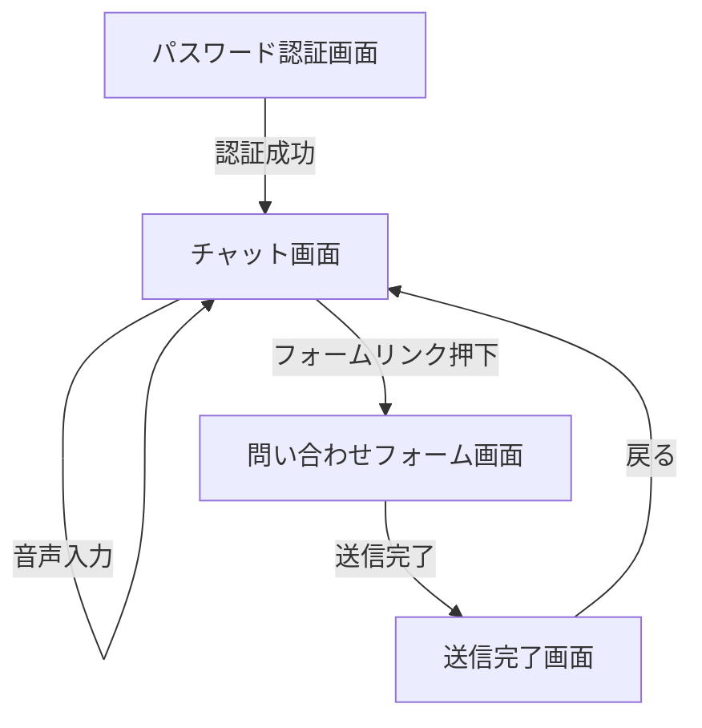

# UI/UXデザイン設計書

## 1. 目的

本ドキュメントは、「Inquiry Chatbot」アプリケーションのユーザーインターフェース（UI）とユーザー体験（UX）を具体的に定義し、ターゲットユーザーである介護・福祉施設スタッフに最適な操作環境を提供することを目的とします。

## 2. デザインコンセプト

### 2.1 コンセプト
**「優しさ」と「明快さ」**

ITツールへの苦手意識を持つユーザーに対し、親しみやすく、迷わないデザインを提供します。「冷たい機械」ではなく、「頼れるパートナー」としての振る舞いを目指します。

### 2.2 カラーパレット

| カラー名 | カラーコード | 用途 | イメージ |
| :--- | :--- | :--- | :--- |
| **Primary Blue** | `#007AFF` | メインカラー、アクションボタン、AIの吹き出し背景 | 清潔感、信頼、CogEvoブランド |
| **Background White** | `#F5F7FA` | 背景色 | 目に優しい、柔らかさ |
| **Text Dark** | `#333333` | 本文テキスト | 視認性確保、コントラスト比配慮 |
| **Text Gray** | `#666666` | 補足テキスト、日付など | 控えめな情報 |
| **Error Red** | `#FF3B30` | エラーメッセージ、警告 | 注意喚起 |
| **Success Green** | `#34C759` | 完了メッセージ、解決ボタン | 安心感、成功 |

### 2.3 タイポグラフィ

-   **フォントファミリー**: システムフォント（San Francisco, Helvetica Neue, Hiragino Sans, sans-serif）を優先し、可読性とロード速度を重視。
-   **フォントサイズ**:
    -   本文: `16px` (高齢者層への配慮で大きめに設定)
    -   見出し: `20px` ~ `24px`
    -   補足: `14px` (これ以下は避ける)
-   **行間 (line-height)**: `1.6` 以上を確保し、文章の塊を感じさせないようにする。

## 3. 画面遷移図 (Mermaid)

## 4. 画面詳細仕様 (ワイヤーフレーム)

### 4.1 パスワード認証画面

-   **目的**: 関係者以外のアクセスを制限する。
-   **構成**:
    -   中央配置のカード型レイアウト。
    -   ロゴ画像。
    -   「パスワードを入力してください」のテキスト。
    -   パスワード入力フィールド（伏せ字）。
    -   「ログイン」ボタン（Primary Color）。
    -   エラーメッセージ表示エリア（パスワード不一致時）。

### 4.2 チャット画面 (メイン画面)

-   **目的**: AIとの対話による問題解決。
-   **ヘッダー**:
    -   左側: アプリロゴ / タイトル「サポートチャット」。
    -   右側: 「免責事項」リンク（モーダルまたは別タブ）。
-   **メインエリア (チャットログ)**:
    -   スクロール可能なメッセージリスト。
    -   **AIメッセージ**: 左寄せ、アイコン付き、Primary Blue背景（白文字）または淡い青背景。Markdown対応（箇条書き、リンク）。
    -   **ユーザーメッセージ**: 右寄せ、白背景（枠線あり）またはグレー背景。
    -   **ローディング表示**: AI応答待ちの「...」アニメーション。
-   **フッター (入力エリア)**:
    -   **クイック質問**: 横スクロール可能なチップリスト（例：「ログインできない」「画面が真っ暗」「音が出ない」）。タップで即時送信。
    -   **テキスト入力**: 複数行入力可能なテキストエリア。プレースホルダー「質問を入力してください...」。
    -   **マイクボタン**: 音声入力トグル。録音中は赤色点滅＆波形アニメーション。
    -   **送信ボタン**: 紙飛行機アイコン。入力がある場合のみ活性化。

### 4.3 問い合わせフォーム画面

-   **目的**: AIで解決しなかった場合の最終手段。
-   **構成**:
    -   「お問い合わせフォーム」見出し。
    -   「AIで解決しなかった内容を専門スタッフへ送信します。」の説明文。
    -   **入力項目**:
        -   施設名 (必須)
        -   担当者名 (必須)
        -   連絡先 (電話/メール選択・必須)
        -   問い合わせ内容 (必須, テキストエリア, AIとのチャット履歴を引用可能にすると尚良し)
    -   **アクション**:
        -   「送信する」ボタン（Primary Color）。
        -   「チャットに戻る」リンク（Secondary Color）。

### 4.4 送信完了画面

-   **目的**: 問い合わせ完了のフィードバック。
-   **構成**:
    -   チェックマークアイコン（Success Green）。
    -   「送信が完了しました」のメッセージ。
    -   「担当者より順次ご連絡いたします。」の補足。
    -   「チャット画面へ戻る」ボタン。

## 5. インタラクション

-   **チャットスクロール**: 新しいメッセージが追加されるたびに自動で最下部へスクロール。ただし、ユーザーが過去ログ閲覧中にスクロールアップしている場合は自動スクロールを停止する（「新しいメッセージがあります」ボタンを表示）。
-   **音声入力**:
    -   マイクボタン押下 -> ブラウザ許可ダイアログ -> 録音開始（「お話しください...」表示）。
    -   無音検知または停止ボタン -> テキスト化 -> 入力欄にセット（誤認識修正のため即送信はしない）。
-   **フィードバック**:
    -   回答の下に「解決した 👍」「解決しない 👎」ボタンを表示。タップでThanksメッセージに切り替え。
