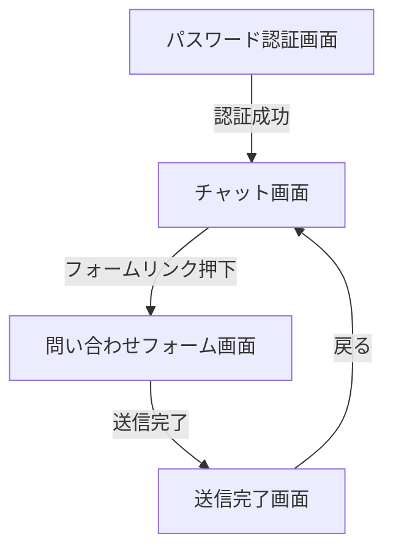
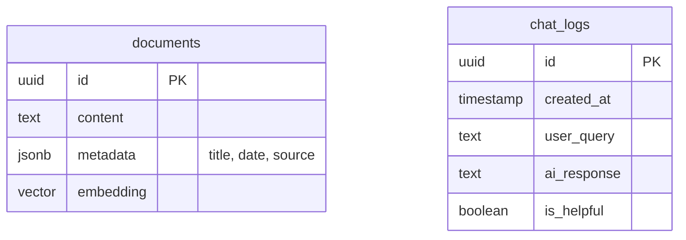

# 要件定義書（詳細）

## 1. プロジェクト概要

### 1.1 背景
認知機能向上ツール「CogEvo」の利用拡大に伴い、介護・福祉施設の現場スタッフからの問い合わせが増加している。現状はメールや電話での個別対応が中心であり、特に専門知識を要する問い合わせにおいて、社内エキスパートへのエスカレーションによる目詰まり（ボトルネック）が発生している。これにより、回答待ち時間の発生や社内リソースの圧迫が課題となっている。

### 1.2 目的
社内ドキュメント（マニュアル、FAQ等）を活用したAIチャットボットを導入し、現場スタッフが24時間365日いつでも自己解決できる環境を構築する。これにより、問い合わせ対応工数の削減、社内エキスパートの負荷軽減、およびユーザーの利便性向上を実現する。

### 1.3 スコープ
- **対象**: CogEvoを利用する介護・福祉施設のスタッフ向けサポートサイト（Webアプリ）。
- **対象外**: CogEvo本体（アプリ/管理画面）への組み込み、ユーザーごとの個別ID管理、契約情報の参照・変更機能。

## 2. ビジネス要件

### 2.1 リーンキャンバス（要約）
- **課題**: 専門的問い合わせによるサポート部門の疲弊、ユーザーの待ち時間発生。
- **顧客セグメント**: ITリテラシーが高くない介護・福祉施設スタッフ（タブレット利用中心）。
- **独自の価値提案**: 「エンジニアの頭脳」と「メンターの語り口」を持つAIによる、専門用語を使わない即時解決サポート。
- **ソリューション**: Gemini API + RAGを活用した自動応答チャットボット。
- **チャネル**: Webブラウザ（QRコードや製品ページリンク経由）。

### 2.2 目標（KPI/KGI）
- **KGI**: 問い合わせ対応工数の30%削減（定性目標として設定、フェーズ1検証後に数値化）。
- **KPI**:
    - AIチャットボットの月間利用数
    - 解決率（「解決した」ボタンの押下率）
    - 問い合わせフォームへの遷移率（低いほど良いが、初期は誘導数も計測）

## 3. ユーザー要件

### 3.1 ターゲットユーザー
**メインペルソナ：介護施設スタッフ Aさん（50代女性）**
- **属性**: 介護福祉士。スマホはLINE程度。業務ではiPadでCogEvoを利用。
- **状況**: 利用者のリハビリ中にCogEvoが動かなくなり、焦っている。
- **心理**: 「機械は苦手」「壊したくない」「専門用語はわからない」「電話は待たされるから嫌」。
- **ニーズ**: 「どうすれば直るか、簡単な言葉ですぐ教えてほしい」。

### 3.2 ユーザーストーリー
1. **トラブル解決**: ユーザーは、利用中にエラーが出た際、チャットボットに「動かない」と話しかけるだけで、対処法をステップバイステップで教えてもらえる。
2. **操作確認**: ユーザーは、新しい機能の使い方を忘れた際、クイック質問ボタンから「マニュアルを見たい」を選び、該当ページや要約を即座に確認できる。
3. **エスカレーション**: ユーザーは、AIで解決しなかった場合、スムーズに問い合わせフォームへ誘導され、ストレスなく担当者に連絡できる。

### 3.3 MVPの定義
- 共通パスワードによる簡易認証を備えたWebチャット画面。
- テキストおよび音声入力による質問が可能。
- マニュアル・FAQ・アップデート情報を元にした回答生成。
- 解決できない場合のフォーム誘導機能。

## 4. 機能要件

### 4.1 機能一覧（MoSCoW）

| 優先度 | 機能名 | 概要 |
| :--- | :--- | :--- |
| **Must** | **簡易認証** | 共通パスワード入力によるアクセス制限 |
| **Must** | **RAG検索・回答生成** | Gemini APIを利用した、社内ドキュメントに基づく回答生成 |
| **Must** | **テキストチャットUI** | 対話形式のインターフェース、免責事項表示 |
| **Must** | **音声入力** | Web Speech APIを用いた音声認識ボタン |
| **Must** | **クイック質問** | 頻出質問のワンタップ送信ボタン |
| **Must** | **フォーム誘導** | 回答不能時の問い合わせフォームリンク表示 |
| **Must** | **問い合わせフォーム** | 施設名・連絡先等の入力とメール送信機能 |
| **Should** | **ログ保存** | 質問・回答ログのDB保存（改善分析用） |
| **Should** | **フィードバック** | 回答に対する「解決した/しない」ボタン |
| **Nice** | **会話履歴保持** | セッション内での文脈理解（「それはどうやるの？」等への対応） |

### 4.2 機能詳細仕様

#### 4.2.1 チャット回答生成 (RAG)
- **ユースケース**: ユーザーが質問を送信した際、AIが回答を返す。
- **正常系フロー**:
    1. ユーザー入力（テキスト/音声）を受け取る。
    2. 入力内容をベクトル化し、Supabaseから関連ドキュメントを検索（最新のUpdate情報を優先）。
    3. 検索結果とシステムプロンプト（メンター人格）をGemini APIに送信。
    4. 生成された回答をストリーミング形式で画面に表示する。
- **例外系フロー**:
    - 関連情報が見つからない場合：「申し訳ありません、資料に関連情報が見当たりませんでした」と返し、フォームへ誘導する。
    - APIエラー時：「一時的なエラーが発生しました。もう一度お試しください」と表示。

#### 4.2.2 音声入力
- **ユースケース**: キーボード入力が苦手なユーザーが声で質問する。
- **仕様**:
    - 入力欄横のマイクアイコンをタップして起動。
    - ブラウザの許可ダイアログ承認後、録音開始。
    - 「認識中...」のアニメーションを表示。
    - 発話終了（無音検知）または停止ボタンタップでテキスト化し、入力欄に反映（自動送信はしない、ユーザー確認を挟む）。

#### 4.2.3 問い合わせフォーム
- **ユースケース**: AIで解決しなかった場合、担当者にメールを送る。
- **仕様**:
    - 入力項目: 施設名(必須), 担当者名(必須), 連絡先(電話/メール選択・必須), 問い合わせ内容(必須)。
    - 送信ボタン押下後、SendGrid等のメールサービス経由で `customer@tbc410.com` へメール送信。
    - ユーザーには完了画面を表示し、チャットへ戻る導線を設置。

## 5. UI/UX設計

### 5.1 デザインコンセプト
- **コンセプト**: 「優しさ」「明快さ」。ITツールへの苦手意識を払拭する。
- **カラーパレット**:
    - メイン: CogEvoブルー `#007AFF` (仮定) - 清潔感、信頼。
    - 背景: オフホワイト `#F5F7FA` - 目に優しい。
    - 文字: ダークグレー `#333333` - 真っ黒より柔らかく、視認性は確保。
- **タイポグラフィ**:
    - フォントサイズ: 基本 `14px` 以上、高齢者層も意識し大きめに設定。
    - 行間: `1.6` 以上で読みやすく。

### 5.2 画面一覧
1. **パスワード認証画面**: 共通パスワード入力のみ。
2. **チャット画面**: メイン画面。履歴表示、入力エリア、メニュー。
3. **問い合わせフォーム画面**: フォーム入力と送信完了。

### 5.3 画面遷移図（Mermaid）


### 5.4 ワイヤーフレーム
- **チャット画面**:
    - **ヘッダー**: ロゴ、免責事項へのリンク。
    - **メイン**: チャットログ（吹き出し）。AIは左、ユーザーは右。
    - **下部固定**:
        - 上段: クイック質問ボタン（横スクロール）。
        - 下段: マイクボタン、テキスト入力欄、送信ボタン。

## 6. 非機能要件

### 6.1 パフォーマンス
- チャット回答開始までの時間: 3秒以内目標（ストリーミング表示）。
- ページLCP: 2.5秒以内（タブレット4G回線想定）。

### 6.2 セキュリティ
- **認証**: 共通パスワードのハッシュ化照合。
- **通信**: 全経路HTTPS化。
- **データ**: 社外秘データ（個人情報含む）は学習データに含めない。学習データは公開情報（マニュアル、FAQ）と準公開情報（Update資料）のみ。

### 6.3 可用性
- 稼働時間: 24時間365日（VercelのSLAに準拠）。
- メンテナンス時は「メンテナンス中」画面を表示（Next.js機能）。

## 7. データベース設計

### 7.1 ER図（Mermaid）


### 7.2 テーブル定義
- **documents**: RAG用データ。`pgvector` を使用。
    - `content`: ドキュメントのテキスト本文。
    - `metadata`: タイトル、日付（Update資料用）、ファイル名など。
    - `embedding`: 埋め込みベクトル（Gemini embeddingsモデル準拠）。
- **chat_logs**: 分析用ログ。
    - `user_query`: ユーザーの質問文。
    - `ai_response`: AIの回答文。

## 8. インテグレーション要件

### 8.1 外部連携
- **Gemini API (Google)**: チャット生成 (`gemini-2.0-flash` 推奨), Embeddings (`text-embedding-004`)。
- **Supabase**: ベクトルDB、ログ保存。
- **Resend**: メール送信（問い合わせフォーム用）。※Vercel推奨のResendを仮定。

### 8.2 API仕様
- `POST /api/chat`: チャット回答生成。
    - Request: `{ message: string, history: Message[] }`
    - Response: ReadableStream (Server Sent Events)
- `POST /api/inquiry`: 問い合わせメール送信。
    - Request: `{ facility: string, name: string, contact: string, body: string }`
    - Response: `{ success: boolean }`

## 9. 技術選定とアーキテクチャ

### 9.1 技術スタック
- **Frontend**: Next.js (App Router), React, Tailwind CSS
- **Backend**: Next.js Route Handlers (Server Actions)
- **Database**: Supabase (PostgreSQL + pgvector)
- **AI**: Gemini API (Google AI Studio)
- **Auth**: 環境変数による簡易認証 (Middlewareで判定)
- **Hosting**: Vercel

### 9.2 アーキテクチャ図（Mermaid）
```mermaid
graph TD
    User[ユーザー (Browser)] -->|HTTPS| Vercel[Vercel (Next.js)]
    subgraph Vercel
        Middleware[Auth Middleware]
        Page[React Components]
        API[API Routes / Server Actions]
    end
    API -->|Generate| Gemini[Gemini API]
    API -->|Search/Log| Supabase[Supabase (DB)]
    API -->|Send Mail| Resend[Email Service]
    Admin[管理者] -->|Data Import| Supabase
```

### 9.3 コンポーネント設計（Mermaid）
```mermaid
graph TD
    Page[page.tsx (Server)] --> ChatContainer[ChatContainer (Client)]
    ChatContainer --> MessageList[MessageList (Client)]
    ChatContainer --> InputArea[InputArea (Client)]
    InputArea --> MicButton[MicButton (Client)]
    ChatContainer --> QuickQuestions[QuickQuestions (Client)]
    Page --> Disclaimer[Disclaimer (Server)]
```

### 9.4 実装方針
- **状態管理**: `ai/rsc` (Vercel AI SDK) または `useChat` フックを利用し、ストリーミングと状態管理を簡略化する。
- **ディレクトリ構成**: Featuresディレクトリパターンを採用し、機能ごとにまとめる（例: `src/features/chat`, `src/features/inquiry`）。

## 10. リスクと課題

### 10.1 リスク分析
- **回答の正確性**: 古いマニュアルと新しいUpdate資料が競合する可能性。
    - **対策**: `metadata` に日付を含め、検索時に日付による重み付けや、プロンプトでの最新情報優先指示を行う。
- **音声認識の精度**: 施設内の雑音環境。
    - **対策**: 入力後に編集可能なUIにし、誤認識を修正できるようにする。

## 11. ランニング費用と運用方針

### 11.1 費用概算
- **Vercel**: Hobbyプラン（無料）またはPro（$20/月）。MVP段階はHobbyで可。
- **Supabase**: Free Tier（無料）。容量増えればPro（$25/月）。
- **Gemini API**: Pay-as-you-go（無料枠あり、超過分も安価）。
- **Resend**: Free Tier（1日100通まで無料）。
- **合計**: **月額0円〜数千円** で運用開始可能。

### 11.2 運用体制
- **保守**: 社内エンジニア（1名）が兼務。
- **データ更新**: マニュアル改訂時やアップデート案内資料の公開時に、管理者がスクリプトを実行してSupabaseへデータを追加インポートするフローを整備する。

## 12. 変更管理
- GitHub Flowを採用。`main` ブランチへのマージでVercelへ自動デプロイ。

## 13. 参考資料
- [Next.js Documentation](https://nextjs.org/docs)
- [Vercel AI SDK](https://sdk.vercel.ai/docs)
- [Supabase Vector](https://supabase.com/docs/guides/ai/vector-columns)
